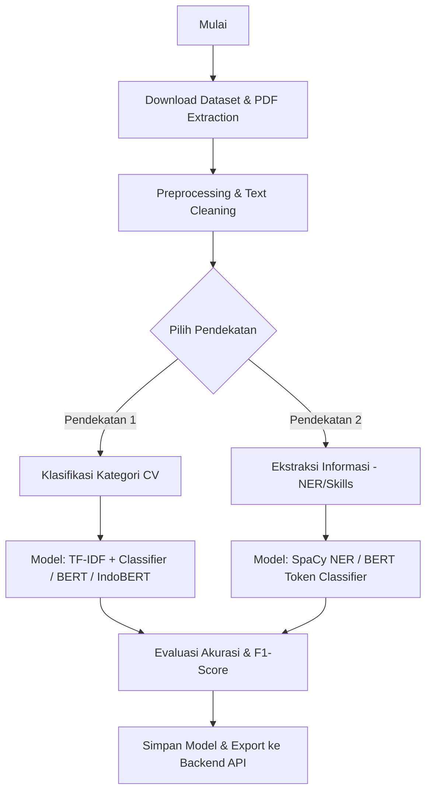

# CV AI Analyzer - Data Science

Selamat datang di folder **Data Science** untuk proyek **Sistem Informasi Pemagangan Mahasiswa**. Folder ini difokuskan untuk pengembangan model AI (Kecerdasan Buatan) yang akan menganalisis CV (Curriculum Vitae) / Resume mahasiswa guna pencocokan otomatis (job matching), ekstraksi keahlian (skills extraction), dan klasifikasi kategori pekerjaan.

---

## 📂 Struktur Folder

```text
data-science/
├── README.md                 # Dokumentasi ini
├── datasets/                 # Folder untuk menyimpan dataset (CSV, JSON, PDF)
├── notebooks/                # Jupyter Notebook untuk eksperimen, EDA, & Training
│   └── 01_eda_and_preprocessing.ipynb
└── scripts/                  # Python scripts untuk download data, preprocessing, dll.
    └── download_dataset.py   # Script otomatis mengunduh dataset dari Hugging Face
```

---

## 📊 Dataset yang Direkomendasikan

Untuk membuat model **CV AI Analyzer**, ada dua pendekatan utama: **Klasifikasi CV** (menentukan kategori pekerjaan) dan **Resume Parsing/NER** (ekstraksi nama, kontak, pendidikan, skill). Berikut adalah dataset terbaik yang dapat digunakan:

### 1. Resume Atlas (Hugging Face)
* **Deskripsi:** Dataset skala besar berisi 13,389 resume berlabel kategori pekerjaan. Sangat cocok untuk melatih model klasifikasi teks modern (seperti BERT, DistilBERT, atau fine-tuning LLM seperti Gemma/Llama).
* **Link:** [Hugging Face - ahmedheakl/resume-atlas](https://huggingface.co/datasets/ahmedheakl/resume-atlas)
* **Tugas:** Klasifikasi Kategori Pekerjaan.

### 2. Advanced Resume Parser & Job Matcher (Hugging Face)
* **Deskripsi:** Dataset resume yang sudah terstruktur dalam format JSON normalisasi. Memiliki field seperti *Experience*, *Education*, dan *Skills*. Sangat bagus untuk melatih parser atau model Named Entity Recognition (NER).
* **Link:** [Hugging Face - datasetmaster/resumes](https://huggingface.co/datasets/datasetmaster/resumes)
* **Tugas:** Ekstraksi Informasi / Parsing & Job Matching.

### 3. Resume Classification Dataset for NLP (Kaggle)
* **Deskripsi:** Dataset legendaris berisi 2,400+ resume dalam format PDF asli, teks mentah, dan HTML. Sangat bagus jika Anda ingin melatih model pipeline dari file PDF mentah langsung.
* **Link:** [Kaggle - Resume Dataset](https://www.kaggle.com/datasets/gauravduttakiit/resume-dataset)
* **Tugas:** Ekstraksi Teks PDF & Klasifikasi.

### 4. Resume NER Dataset (Hugging Face)
* **Deskripsi:** Dataset berlabel untuk token classification (NER). Memiliki anotasi untuk entitas seperti nama, email, nomor telepon, gelar pendidikan, perusahaan, dan keahlian.
* **Link:** [Hugging Face - yashpwr/resume-ner-bert-v2](https://huggingface.co/datasets/yashpwr/resume-ner-bert-v2)
* **Tugas:** Named Entity Recognition (NER) / Ekstraksi Entitas.

---

## 🚀 Cara Memulai

### 1. Prasyarat (Prerequisites)
Pastikan Anda sudah menginstal Python (versi >= 3.8) dan package manager seperti `pip` atau `conda`.

Instal pustaka yang diperlukan untuk mendownload dan memproses data:
```bash
pip install pandas datasets openpyxl huggingface_hub
```

### 2. Mengunduh Dataset Secara Otomatis
Kami telah menyediakan script Python di `scripts/download_dataset.py` untuk mengunduh dataset dari Hugging Face ke folder `datasets/`.

Jalankan perintah berikut dari folder root proyek:
```bash
python data-science/scripts/download_dataset.py
```

---

## 🤖 Rencana Pengembangan Model (Model Roadmap)



1. **Tahap 1: Text Extraction & Normalization**
   * Mengonversi CV format PDF/DOCX menjadi teks mentah menggunakan pustaka Python seperti `PyMuPDF` (fitz) atau `pdfplumber`.
   * Melakukan pembersihan teks (lowercase, menghapus karakter khusus, stopwords removal).

2. **Tahap 2: Feature Engineering & Modeling**
   * **Klasifikasi Pekerjaan:** Menggunakan representasi teks (TF-IDF, Word2Vec, atau Transformer Embeddings) lalu melatih klasifikator (SVM, Random Forest, atau fine-tuning model IndoBERT/BERT).
   * **Ekstraksi Entitas (NER):** Menggunakan `spaCy` untuk melatih custom NER pipeline guna mengenali entitas spesifik seperti *Skills*, *Education*, *Experience*.

3. **Tahap 3: Deployment & Integrasi Backend**
   * Membuat API sederhana menggunakan **FastAPI** atau **Flask** di Python untuk melayani prediksi model.
   * Backend Node.js/Express (yang ada di proyek saat ini) akan mengirim berkas CV PDF ke API Python, lalu menerima hasil parsing (kategori, nama, email, list skill) untuk disimpan ke database Prisma.
